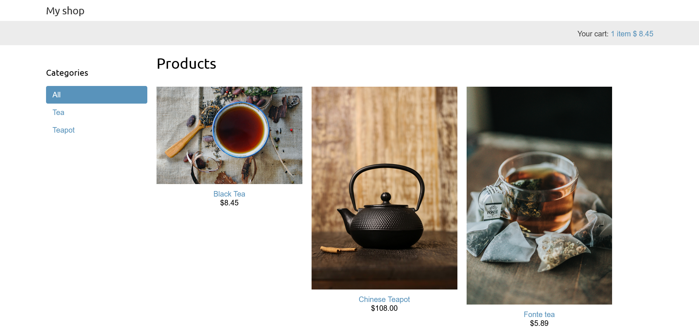

# Интернет магазин

Учебное приложение интернет магазина



## Функции приложения
- Просмотр всех товаров/ по категориям
- Добавление товаров в коризну
- Система купонов и скидок
- Оплата товаров
- Экспорт заказа в CSV
- Генерация счетов и чеков
- Рекомендательная система

## Пройденные темы
- Сеансы Django
- `Celery` и `RabbitMQ` для выполнения асинхронных заданий
- Отслеживание Celery через `Flowers`
- Интеграция `Stripe` для оплаты: API и Webhooks
- Интернационализация

### Запуск redis
```shell
docker run -it --rm --name redis -p 6379:6379 redis
```


_Основано на материалах книги "Django 4 в примерах [2023] Антонио Меле"_