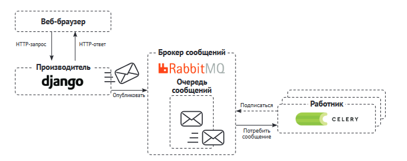

# магазин
## Часть 1

FloatField - проблемы с округлением
> Для хранения денежных сумм всегда лучше использовать DecimalField

### Фреймворк сеансов
* анонимные
* пользовательские

После входа, функция login автоматически переносит все данные из анонимной в пользовательскую

Сеансовые данные хранятся на стороне сервера, а cookie-файлы содержат ИД сеанса
`django.contrib.sessions.middleware.SessionMiddleware` - промежуточный компонент, 
управляет сеансами, встраивается по умолчанию
Делает доступным обращение:
```
request.session['foo'] = 'bar'
request.session.get('foo')
del request.session['foo']
```
Принимает любой объект, который можно сериализовать в JSON

#### Настроечные параметры
модель Session в бд
* SESSION_ENGINE - место, где будут хранится сеансы, варианты хранения:
  * на основе бд
  * файловая система
  * на основе кэша (кэширующие бэкэнды указываются в CACHES) + наилучшая производительность
  * кэшированные сеансы на основе бд - сквозная запись (одновременно в кэш и в ячейку основной памяти, 
  в случае сбоя данные сохранятся). 
  * на основе cookie файлов
> Следует использовать сеансовый механизм на основе кэша (кеш-бэкенд Memcached, механизмы кеширования Redis, 
> другие системы кеширования)
* SESSION_COOKIE_AGE - продолжительность хранения Cookie файлов в секундах. По умолчанию равна двум неделям 
(1 209 600 с)
* SESSION_COOKIE_DOMAIN - домен для Cookie файлов. Установить значение домена для междоменных куки, 
или None для стандартного доменного куки
* SESSION_COOKIE_HTTPONLY - булево значение, при True клиентский js не сможет получать доступ к сеансовому cookie
* SESSION_COOKIE_SECURE - булево значение, отправлять только по протоколу HTTPS
* SESSION_EXPIRE_AT_BROWSER_CLOSE - булево значение, удалять по закрытию браузера (по умолчанию False)
* SESSION_SAVE_EVERY_REQUEST - при True пересохранение в бд и обновление куки при каждом запросе

.set_expiry() - перезапись продолжительности текущего сеанса

### Реализация корзины
идентификаторы товаров в качестве ключа, значения - цена и количество
+ Товар не будет добавляться в корзину более одного раза
+ Упрощает извлечение товаров из корзины
+ Цена фиксируется в корзине или сеансе


### Создание процессора контекста для текущей корзины
Процессор контекста - включение текущей корзины в контекст запроса, независимо от представления
> функция Python, принимает объект request в качестве аргумента и выдает словарь, 
> который добавляется в контекст запроса

+ Хорошо, для того, чтобы сделать что-то глобально доступным для всех шаблонов
- Однако, если на каких-то шаблонах это не нужно, стоит рассмотреть использование _шаблонных тегов_

Встроенные процессоры:
* context_processor.debug - устанавливает переменные debug и sql_queries списка SQL-запросов
* context_processor.request - переменная request
* context_processor.auth - устанавливает переменную user в запросе
* context_processor.messages - все сообщения, сгенерированные фреймворком
* Не отключаемый csrf

### Асинхронные задачи
* для интенсивных процессов обработки данных (транскодирование видео)
* для процессов, подверженных сбоям (отправка писем по SMTP)

Брокер сообщения - протокол обмена сообщениями, управления очередями, хранение и гарантированния доставка.
создание очередей, маршрутизация сообщений, распределение сообщений между работниками

Celery - очередь заданий
* Формирование заданий как асинхронных функций python
* Планирование запуска заданий в определенное время

Брокер сообщений RabbitMQ
* Поддерживает AMQP - Advanced Message Queuing Protocol 



```shell
docker pull rabbitmq
```

```shell
docker run -it --rm --name rabbitmq -p 5672:5672 -p 15672:15672 rabbitmq:management
```
Админ по умолчанию:
login: guest
password: guest

При работе в рабочей среде, нужно удалить пользователя guest и создать нового пользователя-администратора

Работник Celery - процесс, рабочий узел, занимается служебными функциями (отправка/получение сообщений очереди,
регистрация заданий, уничтожение зависших заданий, отслеживание состояний и т.д.)
Экземпляр Работника может потреблять любое число очередей сообщений

```shell
celery -A myshop worker -l info -P gevent
```
(Лучше использовать gevent)

Параметр CELERY_ALWAYS_EAGER - исполнение заданий локально в синхронном режиме, не отправляя их в очередь.
Полезно для модульных тестов или запуска в среде без Celery

```shell
celery -A myshop flower
```

## Часть 2
Платежный шлюз - технология, используемая продавцами для обработки платежей от интернет клиентов

pk_test_...
sk_test_...

pk_live_...
sk_live_...

| Результат                          | Кредитная карта     | CVC           | Дата истечения       |
|------------------------------------|---------------------|---------------|----------------------|
| Успешный платеж                    | 4242 4242 4242 4242 | Любые 3 цифры | Любая дата в будущем |
| Неуспешный платеж                  | 4000 0000 0000 0002 | Любые 3 цифры | Любая дата в будущем |
| Требуется аутентификация 3д секьюр | 4000 0025 0000 3155 | Любые 3 цифры | Любая дата в будущем |


### Веб перехватчик
Событийно-управляемый API (в отличие от запросно-управляемого)
Stripe отправляет уведомление об успешных платежах в реальном времени
payload (полезная нагрузка) 


В тестовой среде - устанавливаем stripe CLI
В производственной - устанавить конечную точку в вебхуках сайта stripe

```shell
stripe login
```
ENTER
```shell
stripe listen --forward-to localhost:8000/payment/webhook/
```

События перехватчика:
payment_intent.created - платежное намерение создано
payment_intent.succeeded - платежное намерение успешно
charge.succeeded - связанный с намерением платеж прошел успешно
checkout.session.completed - сеанс оформления платежа завершен (помечаем заказ как оплаченный

django экранирует результат HTML, поэтому нужно использовать функцию mark_safe (не желательно использовать
с входными данными получаемых от пользователя во избежании атак межсайтового скриптинга XSS)

### Административное действие - импорт заказов в CSV файл
Админ выбирает объекты и может выполнить над ними какое-то действие (по умолчанию удалить)

Написание функции со следующими параметрами:
* текущий отображаемый ModelAdmin
* текущий объект запроса (HttpRequest)
* Набор запросов для выбранных пользователем объектов

Функция исполняется при инициировании действия

### Представления для админа
Создается в файле views.py с декоратором @staff_member_required

target - где открыть ссылку (по умолчанию self - в текущей вкладке)
<a target="_blank"> - открыть ссылку в новой вкладке


### Генерирование счетов фактур
Библиотека ReportLab - исходный код python
Библиотека WeasyPrint - генерация pdf файлов из шаблона html

manage.py collectstatic - копирует все статические файлы в каталог STATIC_URL
Каждое приложение определяет свой static
STATICFILES_DIRS - дополнительно указать расположения 

## Часть 3
### Добавление купонов
...
### Разработка рекомендательного механизма
На основе истории покупке вместе

```shell
docker run -it --rm --name redis -p 6379:6379 redis
```

## Часть 4 - Интернационализация